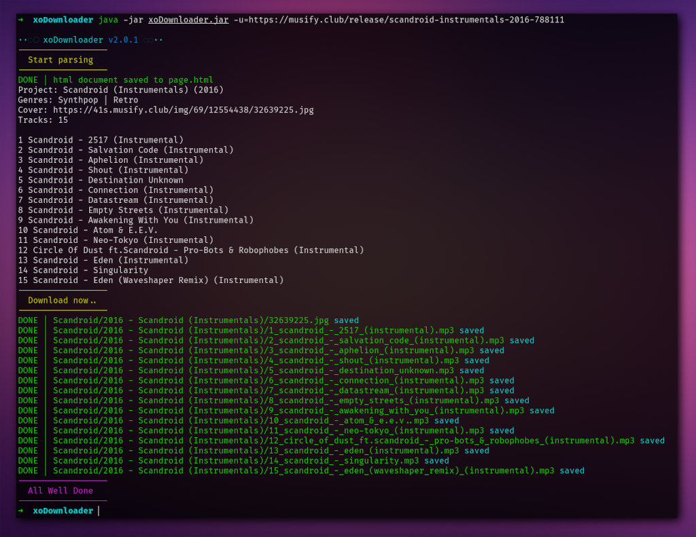

[ ](http://kotlinlang.org)
[ ](https://mit-license.org)
[ ](https://t.me/xo490)


# [xoDownloader](https://github.com/XO490/xoDownloader.git) [ ](https://github.com/XO490/xoDownloader.git)

### Download your favorite albums from https://musify.club 
**For Albums only!** Not for one track

----

[ ](https://github.com/XO490/xoDownloader.git)

### Usage:

```
xoDownloader.jar -u=<albumUrl>

··◌◌ xoDownloader v2.0.3 ◌◌··
-h	this help
-v	version
-u	url for pars and downloads album (example: -u=https://musify.club/release/mujuice-amore-e-morte-2016-699092)

```

example:

```
java -jar xoDownloader.jar -u=https://musify.club/release/mujuice-amore-e-morte-2016-699092
```

----

#### TODO:

- [x] basic download functionality
  - [x] cover image
  - [x] audio
- [ ] progresbar downloading


- Console:
- [x] coloring for linux
- [ ] coloring for windows


- GUI
- [ ] GUI